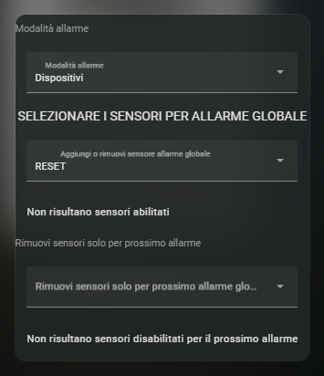
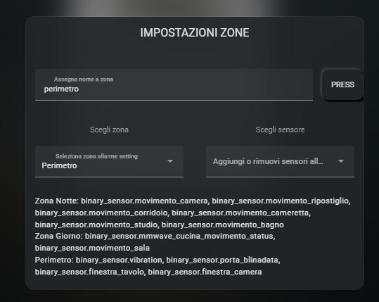
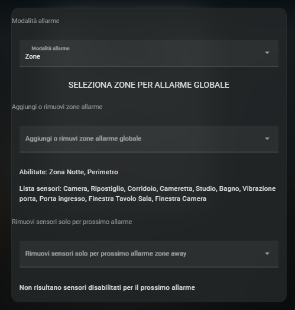
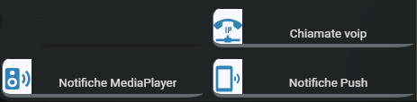
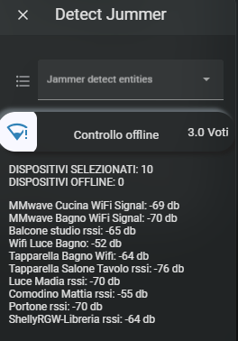
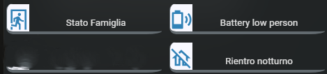
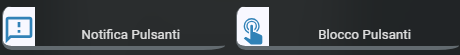
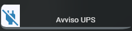
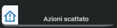
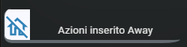

`- Version: 1.2 -`

# Gestione Allarme HomeAssiatant Alarm control panel 

Package completo e modulare per la gestione di un allarme in HomeAssistat

https://github.com/Home-Assistant-Pro-Team/Gestione-Allarme-Home-Assiatant-Alarm/assets/62516592/c7a11ed0-9c74-4b61-ac54-cbe815ff5645


Questo progetto si concentra sull'utilizzo del platform [alarm_control_panel](https://www.home-assistant.io/integrations/manual/) di HomeAssistant, con l'obiettivo di implementare funzioni che gli allarmi tradizionali non offrono. **È importante sottolineare che questo non significa che l'allarme creato sia più affidabile di un allarme commerciale**. Tuttavia, con l'uso di questo pacchetto, è possibile implementare alcune funzionalità aggiuntive non previste dagli allarmi tradizionali.

L'installazione di questo pacchetto è stata progettata per essere il più semplice possibile, anche se alcune parti richiedono una personalizzazione specifica. La particolarità del progetto è che cerca di rendere la gestione dell'allarme il più dinamica possibile, ad esempio non è necessario dichiarare i sensori dell'allarme.

Per far funzionare l'allarme, è sufficiente utilizzare la cartella alarm_control_panel, che gestisce i sensori dell'allarme.

Tuttavia, questo progetto va oltre l'uso semplice della cartella "alarm_control_panel" e offre una gestione più completa dell'allarme. Nelle sezioni successive, spiegheremo in dettaglio le funzioni di ciascuna parte del progetto.

È importante notare che le uniche cartelle obbligatorie da utilizzare sono "Alarm control panel" e "custom_template", mentre gli altri file sono facoltativi. Tuttavia, se si dispone dei dispositivi richiesti, consigliamo l'utilizzo di tutti i file disponibili per migliorare le funzionalità dell'allarme.
### **Indice**
- [Requisiti](#requisiti)
- [Intro](#intro)
- [Alarm control panel](#alarm-control-panel)
	- [General alarm](#general-alarm)
	- [Armed night](#armed-night-e-armed-away)
	- [Armed away](#armed-night-e-armed-away)
- [Skill device](#skill-device)
	- [Notifiche](#notifiche)
		- [Voip](#notifiche-voip)
		- [Media Player](#notifiche-media_player)
		- [Push](#notifiche-push)
	- [Battery status alarm](#battery-status-alarm)
	- [Campanello](#campanello)
	- [Sirena](#sirena)
	- [Controlcode](#controlcode)
		- [General code](#general-code)
		- [With card](#with-card)
		- [Keypad](#keypad--tastierino-esterno)
	- [Detect jummer](#detect-jummer)
	- [Led allarme](#led-allarme)
	- [NFC](#nfc)
	- [Smart lock](#smart-lock)
		- [NFC](#smart-lock-nfc)
		- [Keypad](#smart-lock-keypad)
	- [Person](#person)
	- [Detached](#detached)
		- [Shelly](#detached-shelly)
		- [General (Shelly ed Esphome)](#general-detached-alarm)
	- [Status ups](#ups-alarm)
	- [Status router](#router-alarm)
	- [Notifiche](#notifiche)
	- [CCTV](#cctv)
- [Scene](#scene)
	- [Action alarm](#action-alarm)
	- [Insert armed away](#insert-armed-away)
	- [Insert armed night](#insert-armed-night)
	- [External button alarm](#external-button-alarm)
- [Card](#card)
- [ChangeLog](#change-log)
### **Requisiti**
- [HomeAssitant release 2023.4 ](https://www.home-assistant.io/blog/2023/04/05/release-20234/)
- [Cartella Package abilitata](https://www.home-assistant.io/docs/configuration/packages/)

### **Intro**
Il pacchetto è organizzato in diverse cartelle.

Nei file YAML in cui sono presenti i "node_anchors", è necessario personalizzare il documento aggiungendo le proprie entità. Ad esempio:
```
homeassistant:
  customize:
    package.node_anchors:
        Allarme: &alarm alarm_control_panel.home_alarm
```
La prima cosa da fare è caricare la cartella "custom_templates" nella directory "conf". 

Inoltre, è necessario personalizzare le entità presenti nel file "alarm.jinja" per adattarle alle proprie esigenze. 
- **alarm.jinja**
	In questo file occore inserire codici e l'entità allarme utilizzati

	```
	
		{

	{# Inserire la propria entità alarm_control_panel creata con file general_alarm #}
			"alarm": "alarm_control_panel.home_alarm",

	{# Inserire il codice dell'allarme #}
			"code": "1234",

	{# Inserire il codice di servizio che può essere attivato e disattivato da UI. #}
	{# ATTENZIONE: Se il codice viene cambiato occorre riavviare HA #}
			"code_service" : "9877",

	{# Inserire il codice di emergenza per disattivare l'allarme ma inviare comunque notifica #}
			"emergency_code": "5555",

	{# Numero di tentativi per digitare codice allarme #}
			"alarm_code_attempts": "3",

	{# Inserire il codice di sblocco della serratura solo se necessario; altrimenti, inserire il codice dell'allarme. #}		
			"code_porta": "6666"

		}
	

- **personal.jinja**

	Questo file sarà utilizzato per altri progetti all'interno di questo repository GitHub. Nel file, impostiamo dati personali che verranno utilizzati in tutti i progetti. È sufficiente inserire le proprie entità rispettando l'indentazione JSON.

	Vediamo come personalizzarlo. Anche se non tutte le informazioni sono necessarie per questo pacchetto, è consigliabile compilare tutti i campi per poter sfruttarlo appieno in altri progetti.

	In questa sezione, definiamo le entità e i sensori per ogni persona. Se non si desidera associare un numero di cellulare o un sensore di sveglia a una persona specifica, è sufficiente assegnare il valore "none" nella sezione corrispondente del file. Per aggiungere o rimuovere persone dalla lista di dizionari, è necessario prestare attenzione alla sintassi JSON.

	```
	
	[
		{
			"person": "person.marco",
			"battery": "sensor.cellulare_marco_battery_level",
			"notify": "mobile_app_cellulare_marco",
			"sveglia": "sensor.cellulare_marco_prossimo_allarme",
			"cellulare": "331000000"
		},
		{
			"person": "person.serena",
			"battery": "sensor.cellulare_serena_livello_della_batteria",
			"notify": "mobile_app_samsung_s21",
			"sveglia": "none",
			"cellulare": "335000000"
		}
	]
	
	```
	In questa sezione, elencheremo i nostri media player utilizzati per le notifiche. Assicurati di inserire correttamente i media player selezionati per le notifiche Alexa e TTS (ad esempio, Google), seguendo attentamente la sintassi corretta.

	```
	
		
		
			{{ integrations }}
		
	
	```
## **Alarm control panel**:
I file principali si trovano nella cartella *alarm_control_panel*
#### **General alarm**:
- Viene creata l'entità alarm_control_panel per gestire l'allarme
- Viene  creato l'*input_boolean.alarm_triggered_state*:	
	-  Questo input viene utilizzato per determinare se l'allarme è scattato da quando è stato inserito. 
	-  Lo stato di questo boolean viene utilizzato in altri file del pacchetto.
- Viene creato il sensore delle zone con i relativi sensori associati.
- Viene creato un boolean per gestire la modalità ospite
- Vengono creati due gruppi: **exclude_alarm_entities ed include_alarm_entities**, che permettono di includere o escludere entità che non sono necessarie per il pacchetto o che non vengono rilevate automaticamente. Le entità sono utilizzate nei seguenti file:
	- STATO BATTERIA DISPOSITIVI file: "battery_status_alarm": 
		- È possibile aggiungere altri sensori per monitorare lo stato della batteria. 
		- Non è obbligatorio utilizzare il sensore di batteria predefinito, ma è possibile scegliere qualsiasi altra entità del dispositivo da monitorare (ad esempio, lock.danalock).
		- E' possibile **solo** includere i sensori 
	- PULSANTI FISICI "file: real_input_alarm":
		- E' possibile **solo** escludere i sensori 
		- Nota: le entità che utilizzano il servizio event: shelly.click (shelly utilizzati con pulsanti 'Momentary') non possono essere né escluse né incluse.
	- SENSORI PER ALLARME file:"armed_away & armed_night":
		- E' possibile includere o escludere binary_sensor in entrambi i gruppi contemporaneamente
		- Nota: utilizzare solo i binary_sensor
	- ALLARME SCATTATO: file: action_alarm:
		- Se l'allarme viene disattivato durante lo stato pending(luci accese) le luci vengono spente con la possibilità di lasciare accese solo quelle inserite nel gruppo "exclude_alarm_entities", ma solo se è **dopo il tramonto**.
	- DETECT_JAMMER: E' possibile escludere i sensori che non si vogliono nella lista mentre per includerli occorre assegnere ai sensori il corretto device_class signal_strength.
	- INSERT_ARMED/AWAY-NIGHT: 
		- E' possibile **solo** escludere i sensori 
		- E' possibile escludere cover che non si vogliono utilizzare nel pacchetto per esempio tende da sole.
#### **Armed night e Armed away**:


- Viene creato un template select che permette di avere la lista di tutti i sensori utilizzati per il funzionamento dell'allarme, filtrati per dominio e device_class.
- Quando si seleziona un sensore dal select, viene automaticamente aggiunto alla lista dei sensori abilitati per allarme, se già presente, viene rimosso.
- Quando lo stato dell'allarme passa a ARMED_NIGHT o ARMED_AWAY, i sensori con device_class: window (finestre) che si trovano nello stato "on" (aperte) vengono esclusi dal trigger (non vengono rimossi dalla lista).
- Quando una finestra che era stata precedentemente esclusa dal funzionamento viene chiusa e trascorrono 10 minuti, viene automaticamente reinserita tra i sensori per il controllo dell'allarme, ma SOLO durante lo stato ARMED_NIGHT.
- È possibile escludere dai sensori selezionati solo per la modalità ARMED_AWAY durante un singolo inserimento dell'allarme, sia prima di attivarlo che dopo. Questa esclusione rimane in vigore fino a quando l'allarme viene disattivato.
- L'automazione si occupa di tutto: quando un sensore passa allo stato "on", viene automaticamente attivato il trigger corrispondente.
- È possibile escludere o includere singoli sensori anche con allarme in corso dall'interfaccia utente (UI).
- Nelle notifiche, viene sempre identificato l'ultimo sensore che ha effettivamente cambiato stato, indicando l'orario in cui ciò è avvenuto.
- È possibile decidere quali sensori includere o escludere dalla lista utilizzata nella funzione "select" nel file "general_alarm", inserendo le entità nei gruppi exclude_alarm_entities e include_alarm_entities.

*NB Assicurati di aver impostato correttamente l'attributo **device_class: window** sui dispositivi utilizzati per le finestre. Se non è impostato correttamente, lo stato della finestra non verrà rilevato correttamente e non verrà esclusa dal funzionamento dell'allarme se viene lasciata aperta ma verrà trattata come un sensore generico dell'allarme.*

#### **Armed night zone e Armed away zone**:

Il comportamento dei file è identico a quello descritto in precedenza, tuttavia l'abilitazione riguarda le zone abilitate anziché i singoli sensori.

Le zone possono essere create tramite l'opzione 'Imposta zone' nelle impostazioni.

NB: Per eliminare le zone precedentemente create, è sufficiente inserire la parola 'RESET' come se si stesse creando una nuova zona."

Le zone vengono create da setting --> imposta zone
NB: Per cancellare le zone le creata occorre inserire la parola RESET come se fosse una nuova zona



Le zone abilitate vengono scelte dal pulsante sensor global/sensor night



## **Skill device**
Nella cartella **skill_device** sono presenti diversi file che possono essere utilizzati a seconda delle tue esigenze personali. Tuttavia, nessuno di questi file è indispensabile per il corretto funzionamento dell'allarme.

#### **Notifiche**:



Per rendere più semplice la scelta delle notifiche in base ai dispositivi utilizzati, stiamo introducendo un sistema centralizzato. Questo sistema permette di personalizzare le notifiche attivate su diverse tipologie di dispositivi, come push, chiamata VoIP e media player. È importante precisare che i file relativi a questa scelta non sono indispensabili per il funzionamento generale.
  - #### **Notifiche voip**: 
	Utilizziamo l'addon ["ha-sip" sviluppato da Arne Gellhaus](https://github.com/arnonym/ha-plugins), il quale ci consente di ricevere chiamate direttamente da Home Assistant. Questo addon deve essere installato e funzionante affinché possiamo sfruttarne le funzionalità. Nel file "alarm.jinja" è possibile inserire il numero di telefono associato a ciascuna persona. Nel caso in cui non si desideri impostare un numero di telefono per una determinata persona, è sufficiente assegnare il valore "none" al campo "cellulare" corrispondente. Seguendo queste piccole indicazioni, saremo in grado di ricevere le notifiche come di seguito descritto.

	A meno di alcune eccezioni, come ad esempio il codice di emergenza con tastierino, riceveremo una chiamata a cui dovremo rispondere entro 30 secondi. Trascorso questo tempo, il sistema effettuerà una nuova chiamata alla persona successiva nella lista, il cui numero di telefono è stato impostato. Se rispondiamo alla chiamata, ascolteremo un messaggio che descrive il problema per il quale stiamo ricevendo la chiamata, offrendoci la possibilità di selezionare diverse opzioni. Nel caso in cui inseriamo il codice dell'allarme, esso verrà disattivato e non saranno effettuate ulteriori chiamate alle persone rimanenti nella lista. Digitando l'asterisco, impediremo le chiamate alle persone successive nella lista. Nel caso in cui digiti un codice non valido, riceverai un avviso che il codice inserito non è valido. Se non effettuiamo selezioni entro 20 secondi, la chiamata verrà terminata e verrà effettuata una chiamata alla persona successiva nella lista.

	Per abilitare una chiamata, è sufficiente rimuovere il carattere "#" dalle corrispondenti condizioni nel file. Al contrario, se si desidera disabilitare una chiamata, è possibile commentare le relative condizioni inserendo il carattere "#".

	Una volta completate queste operazioni, le automazioni nel pacchetto saranno pronte per inviare le chiamate ai dispositivi coinvolti.

	*Si tenga presente che questo file è stato scritto considerando l'utilizzo di un FritzBox per la gestione delle chiamate SIP. Per creare un interno voip bastera accedere al vostro router, in seguenza andare su TELEFONAIA -> DISPOSITIVI DI TELEFONIA -> CONFIGURAZIONE NUOVO DISPOSITIVI -> TELEFONO -> LAN/WIFI -> assegnare un user e password e personalizzare l'esempio riportato nel [github](https://github.com/arnonym/ha-plugins). Nel caso in cui si utilizzi un provider o dispositivo diverso, sarà necessario modificare il parametro relativo al servizio Registrar SIP per adattare il file alle specifiche del proprio sistema.*
  - #### **Notifiche media_player**: 
	Nel file "alarm.jinja", è necessario includere i media_player ai quali inviare la notifica. I dispositivi supportati includono Alexa e TTS (ad esempio, Google). Il servizio TTS predefinito è "google_translate_say".

	Per abilitare una notifica, è sufficiente rimuovere il carattere "#" dalle corrispondenti condizioni nel file. Al contrario, se si desidera disabilitare una notifica, è possibile commentare le relative condizioni inserendo il carattere "#".

	È possibile personalizzare il volume predefinito delle notifiche modificando il valore nella variabile dell'automazione. Nel caso si desideri cambiare il volume di una singola notifica, è possibile aggiungere il parametro "volume" durante la creazione dell'evento nell'automazione corrispondente. È importante notare che alcune notifiche potrebbero già avere volumi preimpostati in base allo stato dell'allarme.
  - #### **Notifiche push**: 
	Per inviare le notifiche, utilizziamo l'applicazione nativa di Home Assistant, "App companion". Per abilitare una notifica, è sufficiente rimuovere il carattere "#" dalle corrispondenti condizioni nel file. Al contrario, se si desidera disabilitare una notifica, è possibile commentare le relative condizioni inserendo il carattere "#".

	Nel file "alarm.jinja", è necessario inserire il servizio di notifica mobile assegnato alla persona interessata.

	Una volta completate queste operazioni, le automazioni nel pacchetto saranno pronte per inviare le notifiche ai dispositivi coinvolti.
#### **Battery status alarm**: 
In questo file, è possibile configurare la ricezione di una notifica quando la carica della batteria di un dispositivo monitorato dall'allarme scende al di sotto del 10%. Puoi anche aggiungere dispositivi che non sono presenti nella lista predefinita, come ad esempio serrature intelligenti, aggiungendo l'entità del dispositivo al gruppo "include_alarm_entities" nel file "general_alarm".
#### **Campanello**:
E' stato installato un ESP e al campanello della porta d'ingresso per creare una piccola sirena. Quando viene attivato un sensore dell'allarme, il campanello emette un breve suono come preavviso di allarme. Quando l'allarme viene effettivamente attivato (scatta), il campanello suona in modo intermittente per la durata del triggered, con una frequenza di 1 secondo di suono e 1 secondo di pausa. È possibile interrompere l'intermittenza del campanello disattivando l'allarme.
#### **Sirena**:
Quando viene attivato un sensore dell'allarme, la sirena emette un breve suono come preavviso di allarme. Quando l'allarme viene effettivamente attivato (scatta), la sirena suona per il tempo del triggered. È possibile interrompere la sirena disattivando l'allarme.
#### **Controlcode**:
È possibile utilizzare il tastierino esterno o il tastierino fornito con la card, è anche possibile utilizzare entrambi i tastierini contemporaneamente.

Nella cartella sono presenti diversi file:

 - #### **General code**:
  	Questo file deve essere sempre caricato indipendentemente dal tipo di tastierino utilizzato. Fornisce funzionalità di base per la gestione del codice di accesso.
 - #### **With card**: 
 	Questo file può essere utilizzato solo con la card fornita nel pacchetto. Durante l'utilizzo di questo file, è importante tenere a mente alcune considerazioni importanti. Per esempio, il codice dell'allarme ed il codice di emergenza possono iniziare con lo zero. Il file with_card esegue un controllo per i tentativi di inserimento del codice disarmo. Nel caso in cui il numero massimo di tentativi di codice errati venga superato, l'allarme passa allo stato di scattato ed iniviata una notifica. È anche possibile impostare un codice di emergenza che consente di disattivare l'allarme e inviare una notifica di allerta (voip e push) alle persone che NON si trovano in casa. Durante la sequenza, viene creato un evento per essere utilizzato come trigger in altre automazioni per esempio invio snapshoot telecamere. E' importante notare che utilizzando il codice dell'allarme, rende possibile modificare le impostazioni dalla card anche quando l'allarme è attivo e rimuovere il lock. È inoltre possibile configurare un codice di servizio che può essere condiviso, ad esempio, con il personale di pulizia, che può essere attivato e disattivato dall'interfaccia utente .

 - #### **Keypad / tastierino esterno**: 
 	Il pacchetto include un file readme e un esempio di utilizzo con 3x4 12 Key Matrixe ed EspHome. Il file keypad.yaml è essenziale per il corretto funzionamento dell'allarme. Digitando il codice di sblocco, è possibile attivare l'allarme globale e disattivare sia l'allarme globale che quello notturno. Il sistema effettua un controllo sui tentativi di inserimento del codice errato e invia una notifica se si supera il limite consentito. E' possibile definire un Codice di emergenza, che consente di disattivare l'allarme e inviare una notifica di pericolo (voip e push) solo alle persone che NON si trovano in casa.  Durante la sequenza, viene creato un evento che può essere utilizzato come trigger in altre automazioni, ad esempio per l'invio di snapshot delle telecamere in caso di emergenza. È inoltre possibile configurare un codice di servizio che può essere condiviso, ad esempio, con il personale di pulizia, che può essere attivato e disattivato dall'interfaccia utente .
#### **Detect jummer**:



Si basa sul rilevamento dei dispositivi che passano allo stato offline.

Per semplificare il processo, viene creato un template select che consente di ottenere una lista filtrata dei sensori necessari per il corretto funzionamento. Questa selezione avviene in base al dominio e alla classe del dispositivo.

Attraverso l'interfaccia utente (UI), è possibile inserire i dispositivi all'interno di gruppi specifici per una migliore organizzazione. Inoltre, l'interfaccia utente (UI) offre la possibilità di personalizzare il numero di dispositivi nel gruppo "jammer_detect_device" che vengono considerati in stato offline.

*Per integrare i dispositivi Shelly, è necessario disporre di integrazione ufficiale e aver abilitato il sensore RSSI, mentre per i dispositivi che hanno EspHome occorre avere il sensore con   [platform: wifi_signal](https://esphome.io/components/sensor/wifi_signal.html)*
#### **Led allarme**:
Ho installato un LED accanto alla porta di casa per tenere sotto controllo lo stato del mio sistema di allarme. Il funzionamento del LED è il seguente:
- Quando il sistema di allarme è disattivato, il LED rimane spento. Questo indica chiaramente che il sistema è inattivo e non è attivo alcun tipo di protezione.
- Quando il sistema di allarme viene attivato, il LED si accende, segnalando che il sistema è attivo e pronto a rilevare eventuali intrusioni.
- Se l'allarme scatta, ad esempio a causa di un'effrazione, il LED inizia a lampeggiare, fornendo un'indicazione visiva chiara che l'allarme è stato attivato. Il lampeggio del LED continua finché l'allarme non viene disattivato per 10 minuti. Trascorsi i 10 minuti, il LED torna allo stato spento.
#### **NFC**:
L'NFC viene utilizzato esclusivamente per attivare l'allarme nella modalità 'away' e per disattivare l'allarme.. Se l'allarme si trova nelle modalità 'away' e 'night', l'allarme viene disattivato. Per garantire una maggiore sicurezza, viene effettuato un controllo sull'ID del dispositivo. In questo modo, solo i dispositivi autorizzati possono attivare o disattivare l'allarme.
#### **Smart lock**:
Nella cartella sono presenti tre file che descrivono come utilizzare una serratura smart, ad esempio il modello Danalock, con tre modalità diverse. Questi file forniscono istruzioni dettagliate su come integrare la serratura smart nel sistema di allarme e utilizzarla in modo efficace. 
 - #### **Smart lock nfc**: 
 	La serratura smart può essere controllata anche tramite un tag NFC, consentendo di aprire o chiudere la porta  senza la necessità di utilizzare una chiave tradizionale 
 - #### **Smart lock keypad**: 
 	E' possibile gestire l'apertura o la chiusura della serratura utilizzando un codice specifico e attivare o disattivare l'allarme tramite il codice dell'allarme.
#### **Person**



Per utilizzare questo file, è necessario personalizzare gli anchor.
- Il sistema è in grado di attivare e disattivare l'allarme globale in base alla presenza di persone in casa, sempre che la modalità ospite non sia attiva. 
- Se l'allarme non è attivo e c'è una sola persona in casa, il sistema controlla lo stato della batteria del cellulare, se lo stato è inferiore al 15%, il sistema disattiva l'attivazione automatica dell'allarme fino a quando non aumentano le persone in casa o la batteria torna sopra il 15%. Questo aiuta a evitare l'attivazione accidentale dell'allarme quando c'è solo una persona in casa e la batteria del cellulare è bassa.
- È possibile attivare una notifica che segnala quando la batteria dei cellulari scende sotto il 15% e l'allarme globale è attivo. Nella notifica viene specificato il cellulare scarico e può servire per evitare di rientrare a casa con l'allarme inserito e non avere a disposizione il cellulare per disattivarlo.
- È possibile disattivare automaticamente l'allarme inserito in modalità notturna quando un familiare rientra a casa. In pratica, se l'allarme è attivo e un familiare entra in casa, il sistema rileva la presenza del familiare e disattiva l'allarme, notificando la persona che rientra. L'allarme torna automaticamente alla modalità notturna dopo 5 minuti o quando viene chiusa la porta d'ingresso.

*Per garantire un corretto funzionamento del tracciamento delle persone, ti consigliamo vivamente di leggere l'articolo scritto da [Henrik Sozzi](https://henriksozzi.it/2021/05/posizione-delle-persone-con-home-assistant/). Questo articolo fornisce una spiegazione esaustiva sul funzionamento e la configurazione del sistema di tracciamento. Leggendolo, sarai in grado di ottenere una comprensione approfondita su come impostare correttamente il tracciamento e raggiungere i risultati desiderati.*
#### **Detached**



  - #### **Detached shelly**: 
  	Questo file serve per attivare la funzione "detached" su tutti i dispositivi Shelly che funzionano con l'integrazione ufficiale di Home Assistant. La funzione "detached" consente di disattivare i tasti fisici dei dispositivi, ma di continuare a utilizzare i relè tramite Home Assistant. Il file funziona in questo modo: quando eseguiamo lo script "detached_on", viene prima controllato che lo stesso script non sia stato eseguito due volte consecutive. Successivamente, viene salvato lo stato attuale dei pulsanti in un sensore, dopodiché tutti i dispositivi vengono impostati in modalità "detached". Quando invece eseguiamo lo script "detached_off", viene controllato che lo stesso script non sia stato eseguito due volte consecutive. Successivamente, vengono reimpostati tutti i dispositivi con le impostazioni in uso prima dell'attivazione della funzione "detached".
  - #### **General detached alarm**: 

  	Il file è composto da due automazioni. 
  	- Il concetto si riferisce ad un'automazione che fa scattare l'allarme se la modalità inserita è globale e viene premuto un qualsiasi tasto in casa. L'automazione riconosce tutti i dispositivi Shelly con integrazione ufficiale e tutti i dispositivi Esphome con firmware nella cartella caricato. E' possibile escludere dispositivi dal funzionamento aggiungendo l'entità nel group.exclude_alarm_entities presente nel file general_alarm. Tuttavia, i pulsanti, interruttori e deviatori esterni collegati ai dispositivi Shelly vengono visti in modo diverso tra loro. Per i pulsanti impostati come momentary viene creato un evento (click.shelly), mentre per gli interruttori e deviatori viene creata un'entità nella sezione sensori chiamata input, che di default è disabilitata. Pertanto, è necessario abilitare manualmente il sensore input per ogni singolo dispositivo Shelly interessato, andando su Impostazioni > Dispositivi e servizi > selezionando il dispositivo Shelly interessato e abilitando il sensore input.
  	- Detached alarm: Quando l'allarme scatta, la funzione permette di disabilitare i tasti fisici di tutta la casa. Inoltre, quando l'allarme torna in modalità "disarmed" ma precedentemente l'allarme era scattato, l'automazione ripristina le impostazioni dei tasti allo stato precedente. La funzione "Detached alarm" è compatibile con i dispositivi Shelly che hanno un'integrazione ufficiale (detached_shelly.yaml) e con i dispositivi Esphome che utilizzano il firmware di esempio (firmware_esphome).
#### **UPS alarm**:



Nel sistema, è stato utilizzato un Tecnoware1100. Attraverso questo dispositivo, ricevo una notifica nel caso in cui si verifichi un'interruzione di corrente e una notifica quando la corrente viene ripristinata.
#### **Router alarm**


Se stai utilizzando un router Fritz!Box 6890 con fallback LTE, riceverai una notifica quando la connessione a Internet viene interrotta o ripristinata. Questo dispositivo è in grado di commutare automaticamente sulla connessione LTE in caso di interruzione della connessione principale e invierà una notifica per informarti dello stato della connessione. In questo modo, sarai consapevole delle interruzioni di Internet e dei ripristini.
#### **CCTV**:


Le telecamere vanno inserite nella lista degli anchor. Quando scatta l'allarme viene effettuata una registrazione di 30 secondi ed inviata una notifica a tutti i destinatari inseriti nell'elenco dei notify in alarm.jinja per ogni telecamera. La notifica include uno screenshot della telecamera e due pulsanti di azione: il primo permette di visualizzare il live della telecamera, mentre il secondo consente di accedere alla cartella per riprodurre la registrazione appena effettuata.

*Questo file è stato scritto e testato per dispositivi Android.*
## **Scene**
#### **Action alarm**:



Le azioni della casa vengono programmate per essere eseguite quando viene rilevata un'infrazione con l'allarme inserito. Ecco come funzionano le azioni in base alle diverse fasi:
- Infrazione rilevata (Pending): 
	- Tutte le luci vengono accese. Questo può contribuire a creare un effetto dissuasivo.
- Allarme scattato:
	- Tutte le luci vengono spente. Questo crea un effetto di sorpresa e disorientamento per eventuali intrusi, limitando la loro visibilità all'interno della casa.
	- Le tapparelle vengono chiuse.
	- Viene salvato lo stato corrente delle automazioni (group.automation_action_armed) che devono essere disattivate tramite una scena. Questo permette di ripristinare le impostazioni delle automazioni una volta che l'allarme viene tolto.
	- Le automazioni inserite nel gruppo specificato (group.automation_action_armed) vengono disattivate. Ciò significa che le azioni automatiche associate a queste automazioni, come l'accensione delle luci tramite sensori di movimento, non verranno attivate durante l'allarme.
- Allarme tolto:
	- Se l'allarme viene disattivato durante il pending (quando le luci sono accese):
		- Vengono spente tutte le luci, ad eccezione di quelle incluse nel gruppo specificato (group.exclude_alarm_entities) nel file "general_alarm", ma solo se è dopo il tramonto. Questo permette di mantenere alcune luci accese per motivi di sicurezza o comfort, come luci esterne o luci in determinate zone della casa.
		- Se è prima del tramonto, vengono spente tutte le luci.
- Allarme tolto dopo che è scattato:
	- Vengono riattivate le automazioni utilizzando la scena creata precedentemente. Ciò significa che le automazioni riprendono le loro normali attività come prima dell'allarme, seguendo le routine automatizzate all'interno della casa.

*Si tenga presente che questo file è stato scritto per un'utilizzo personale e potrebbe non rispecchiare le abitudini di tutti. Tuttavia, è stato incluso nel progetto al fine di fornire spunti e possibilità di personalizzazione.*
#### **Insert armed away**:



Quando l'allarme globale viene attivato nella modalità "armed away", vengono eseguite diverse azioni per garantire la sicurezza e l'efficienza energetica della casa. Ecco come funzionano queste azioni:
- Spegnimento televisori e Android TV
- Tutte le luci vengono spente per ridurre al minimo il consumo energetico
- Spegnimento sistemi di climatizzazione (climate), ad eccezione dei climate del frigorifero se sono integrati con smartthinq_sensors. 
- Spegnimento dei ventilatori (fan)

*Si tenga presente che questo file è stato scritto per un'utilizzo personale e potrebbe non rispecchiare le abitudini di tutti. Tuttavia, è stato incluso nel progetto al fine di fornire spunti e possibilità di personalizzazione.*

#### **Insert armed night**:


Il file "Insert armed night" contiene le automazioni per gestire l'attivazione e la disattivazione dell'allarme notturno. Ecco come funzionano queste automazioni:
- Inserimento automatico dell'allarme notte: 

	L'allarme viene attivato in determinate condizioni: 
	
	- se tutti i letti risultano occupati utilizzando i sensori di presenza [bedpresence](https://github.com/Home-Assistant-Pro-Team/Bed-Presence) collegati ai sensori di allagamento Aqara. 
	- L'allarme viene attivato solo se l'ultima stanza rilevata è la camera da letto o la cameretta.
	- Entrambe queste condizioni devono essere soddisfatte per almeno 5 minuti consecutivi.
	- L'attivazione dell'allarme notte avviene solo durante l'intervallo di tempo compreso tra le 21:00 e le 03:00, a meno che la modalità ospite non sia attiva.

	Quando l'allarme notte viene attivato e la modalità ospite non è attiva, vengono eseguite le seguenti azioni:
	- Vengono spente tutte le luci di casa, ad eccezione di quelle nella camera da letto e nella cameretta (è necessaria la configurazione delle luci nelle aree corrette).
	- I televisori che non si trovano nelle camere vengono spenti.
Tuttavia, non vengono interrotte le notifiche in riproduzione su Alexa o su altri dispositivi Google per evitare interruzioni indesiderate.
	- Vengono spenti tutti i dispositivi climate e i fan presenti.
	- Le tapparelle vengono chiuse con una percentuale diversa in base al valore del boolean.winter_summer. Se winter_summer è impostato su off, le tapparelle vengono chiuse completamente. Se invece è impostato su on, le tapparelle vengono chiuse ad una percentuale personalizzata.
- Disattiva allarme notte: 

	La disattivazione dell'allarme notte viene gestita in due momenti separati. La disattivazione avviene solo se la modalità ospite non è attiva e se l'orario è compreso tra le 5:00 e le 11:00.

	Nel primo momento, l'allarme viene disattivato al suono della prima sveglia disponibile impostata (alarm.jinja). Contestualmente vengono aperte tutte le tapparelle, ad eccezione di quelle nelle camere.

	Nel secondo momento, l'allarme viene disattivato e le tapparelle vengono aperte quando tutti i letti sono liberi per almeno 5 minuti consecutivi. 

	In questo modo, l'allarme notte viene disattivato in due momenti distinti, garantendo una gestione appropriata sia in caso di sveglia che quando i letti sono liberi per un determinato periodo di tempo. Allo stesso tempo, l'automazione è configurata in modo da prevenire l'interruzione dell'allarme nei giorni non lavorativi.

*Si tenga presente che questo file è stato scritto per un'utilizzo personale e potrebbe non rispecchiare le abitudini di tutti. Tuttavia, è stato incluso nel progetto al fine di fornire spunti e possibilità di personalizzazione.*

#### **External button alarm**:
Nel seguente scenario, desideriamo sfruttare un pulsante (ad esempio, un pulsante Aqara) per gestire l'allarme. L'obiettivo è consentire di disattivare rapidamente l'allarme notturno quando siamo a casa e di riattivarlo una volta usciti. Questo può essere utile per coloro che lavorano di notte o presto al mattino, ma vogliono comunque garantire la sicurezza della famiglia durante il sonno.

L'automazione associata al pulsante e con l'allarme notturno attivo funziona nel seguente modo: al momento della pressione del pulsante, l'allarme viene disattivato immediatamente. Successivamente, l'automazione aspetta che la porta venga chiusa e quindi riattiva l'allarme. Se nel momento della disattivazione dell'allarme erano presenti più persone in casa e i sensori [bedpresence](https://github.com/Home-Assistant-Pro-Team/Bed-Presence) rilevano ancora qualcuno a letto, l'allarme notturno viene riattivato; in caso contrario, l'allarme globale viene riattivato. Nel caso in cui trascorra un minuto senza che la porta venga chiusa, l'allarme notturno viene riattivato, mentre viene inviata una notifica per avvertire che la porta è rimasta aperta.

L'automazione viene eseguita se la modalità ospiti non è attiva.

*Nel file, occorre personalizzare il trigger dell'automazione con il proprio device ed in base alla propria integrazione. Si tenga presente che questo file è stato scritto per un'utilizzo personale e potrebbe non rispecchiare le abitudini di tutti. Tuttavia, è stato incluso nel progetto al fine di fornire spunti e possibilità di personalizzazione.*
## **Card**
Nel video, viene mostrato che è stato creato un pannello con una tastiera virtuale per accedere alle impostazioni dell'allarme e visualizzare lo stato dell'allarme. Per poter utilizzare questa card, sono necessari i seguenti componenti:

- [Browser mode](https://github.com/thomasloven/hass-browser_mod) 
- [Button card](https://github.com/custom-cards/button-card)
- [Layout card](https://github.com/thomasloven/lovelace-layout-card)
- File "whit_card.yaml": Questo file contiene la configurazione della card della tastiera virtuale. 
- File "jammer_detect.yaml": Assicurati di includere correttamente questo file nella tua configurazione di Home Assistant per garantire un corretto funzionamento della card

È consigliato anche avere una dashboard in modalità YAML come ben descritta da [MaxAlbani](https://www.maxalbani.it/2023/04/home-assistant-dashboards-lo-strumento-per-creare-interfacce-grafiche/#modalita) nel suo articolo.

Quando utilizzi la card della tastiera virtuale, il popup delle impostazioni mostrerà solo le entità dei file che hai deciso di utilizzare.

Puoi utilizzare la card in modalità storage senza attivare la cartella "button_card_templates" (anche se sconsigliato). Per farlo, seleziona la plancia desiderata, apri il menu delle opzioni e scegli "Modifica". Successivamente, accedi all'editor di configurazione testuale e aggiungi "button_card_templates:" all'inizio della plancia, assicurandoti di rispettare l'indentazione corretta. Infine, copia il file del template nella posizione appropriata. Ricorda di fare attenzione alla formattazione e all'indentazione durante il processo di copia. Tieni presente che questa modalità potrebbe non essere raccomandata, ma è possibile utilizzarla se necessario.

```
button_card_templates:
  no_background:
  styles:
  	  card:
	    - background-color: rgba(0,0,0,0.0)
	    - border-width: 0px
	  display:
	  tap_action:
		action: none
...........
title: xxxxx
views:
  - theme: Backend-selected
    title: test_alarm
    path: a
    badges: []
    cards:
...........
```
### **Contributi**
Questo progetto è aperto ai contributi. Se vuoi fornire feedback, segnalare un bug o richiedere una nuova funzionalità, ti invitiamo a creare una issue sul repository.

## Change Log

### Versione: 1.2
- FILE PERSONAL: I dati personali sono stati separati in un nuovo file nella cartella 'custom_templates' per le notifiche, consentendo un utilizzo unico in tutti i progetti del GitHub.
- È stato aggiunto il trigger 'pending' per l'invio di notifiche CCTV.
- I singoli template sono stati sostituiti con macro per ridurre la quantità di codice.
- È possibile escludere determinati sensori solo per la modalità ARMED_AWAY durante un singolo inserimento dell'allarme, sia prima di attivarlo che dopo. Questa esclusione rimane in vigore fino a quando l'allarme viene disattivato.
- Aggiunta funzione zona alla card


### **Supportaci**
Se hai apprezzato questo progetto, ci piacerebbe avere il tuo supporto. Anche un semplice caffè può fare la differenza. 
I fondi raccolti saranno utilizzati per acquistare nuovo materiale e realizzare nuovi progetti. Puoi contribuire cliccando sul pulsante qui sotto. 
Grazie di cuore per il tuo sostegno!

[](https://ko-fi.com/M4M1MI00I)
